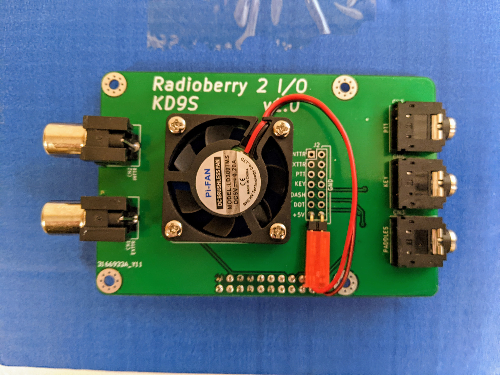
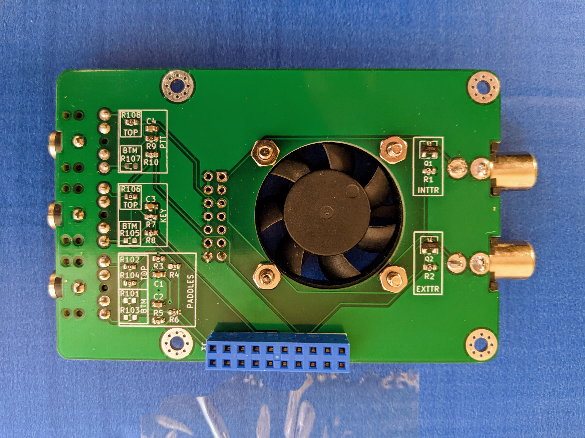
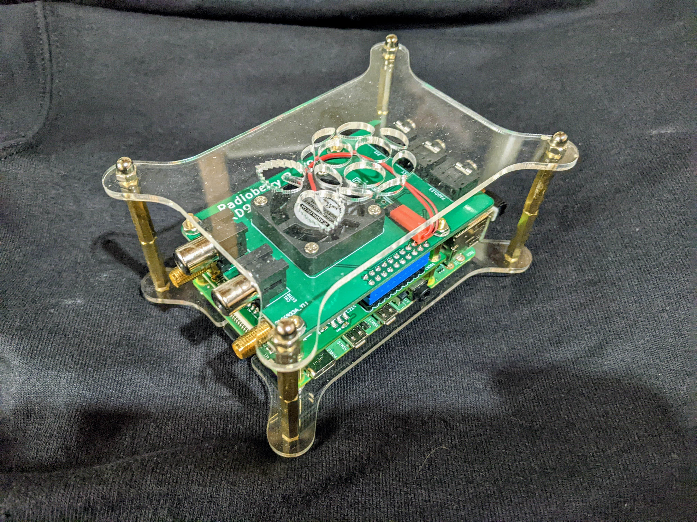

# Radioberry-2-I-O

==================

This is a simple companion board to the Radioberry 2.x to provide I/O and cooling. The minor circuitry used is shamelessly copied from the excellent [Radioberry 2](https://github.com/pa3gsb/Radioberry-2.x) and [Hermes-Lite 2](http://www.hermeslite.com) projects.

I tried to make this board versatile, it can be assembled multiple ways. All SMD parts are on the bottom, but all other components (header/fan/RCA jacks/3.5mm jacks) can be installed on either the top or the bottom. The board pictured has only a 2 pin header installed for the fan, but a 14 pin header can be installed for individual leads or a ribbon cable to be attached to the 5 jacks if they are mounted on a remote panel instead of directly on this board. If installing jacks on the bottom side of this board you'll need to have the SMA connectors on the bottom side of the Radioberry 2 board rather than on top as is usually done. Also, if the fan were installed on the bottom there would not be a lot of clearance between the fan and the Radioberry 2 board so you'll need low profile heatsinks and/or longer headers connecting the 2 boards to get the needed clearance. There is enough room for the I/O header to be a 90-degree header to keep the profile lower if wanted.

The zero-ohm resistors, numbered R10x are only needed when the jacks are installed on this board, and they only need to be installed in either the boxes silkscreened TOP or BTM, never both.

This cheap "case" is some of the parts from one that is meant for a pi cluster stack, available here: [Amazon link](https://www.amazon.com/gp/product/B07JP2TFJY/ref=ppx_yo_dt_b_search_asin_title?ie=UTF8&psc=1)

 
